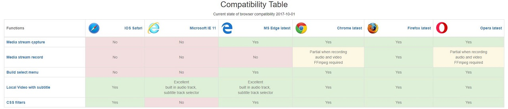

ExpertCamJS 
=============

javascript Camera handler with some options.

    - Capture video, audio
    - Open local video or audio file with subtitle
    - Forward captured stream to another object
    - Grab image from player
    - Record captured stream to webm or ogg
    - Optimized for all modern browser

* [ExpertCamJS] - Online Demo 




Version
----

1.5.0
    - Optimized for all modern browser
    
Version
----
1.2.0

    - Open local video or audio file with subtitle
      using multiselect
    - some minor modification  

Version
----
1.0.0

    - Capture video, audio
    - Open local video and audio files
    - Forward captured stream to another object
    - Grab image from player
    - Record captured stream to webm or ogg

Included recorder
-----------

Stream recorder ([MediaStreamRecorder])
 

Required HTML & Javascript example
--------------

```sh
<!DOCTYPE html>
<html>
    <head>
        <meta charset="UTF-8">
        <title>ExpertCamJS</title>
    </head>
    <body>
        <hr>
        <h1 style="text-align:center;">Examples</h1>
        <hr>
        <h4>Video:</h4>
        <select id="video"></select>
        <hr>
        <h4>Audio:</h4>
        <select id="audio"></select>
        <hr>
        <video></video>
        <hr>
        <button type="button" onclick="play()">play</button>
        <button type="button" onclick="pause()">pause</button>
        <button type="button" onclick="stop()">stop</button>
        <button type="button" onclick="openVideo()">Open</button>
        <hr>
        <script type="text/javascript" src="js/expertcam.js"></script>
        <script type="text/javascript">
        /*--------------------------------------------- Available parameters --------------------------------------------*/

        var defaults = {
            width: 320,
            height: 240,
            constraints: {
                video: {
                    mandatory: {
                        maxWidth: 1280,
                        maxHeight: 720
                    },
                    optional: [{
                        sourceId: true
                    }]
                },
                audio: true
            },
            noSignal: 'media/no_signal.png',
            videoTypes: 'video/mp4|video/webm|video/avi',
            audioTypes: 'audio/wav|audio/mp3|audio/ogg|audio/mp3',
            subTitleTypes: 'srt',
            subTitleCoding: 'utf-8',
            cameraSuccess: function(stream) {
                console.log('cameraSuccess');
            },
            canPlayFunction: function() {
                console.log('canPlayFunction');
            },
            getDevicesError: function(error) {
                console.log(error);
            },
            getUserMediaError: function(error) {
                console.log(error);
            },
            cameraError: function(error) {
                console.log(error);
            }
        };
        /*------------------------------------ Initialization: please check out examples ----------------------------------*/
        /*---------------------------------- Simple initialization with default parameters --------------------------------*/
         new ExpertCamJS('video').init().play();
        /*---------------------------------- Simple initialization with build select menu ---------------------------------*/
        var cam = new ExpertCamJS('video').init(args).buildSelectMenu('#video', '#audio');
        function play(){
            cam.play();
        }
        function pause(){
            cam.pause();
        }
        function stop(){
            cam.stop();
        }
        function openVideo(){
           cam.playLocalVideo();
        }
        /*---------------------------------- Simple initialization with play local video ----------------------------------*/
        var args = {
            width: '100%',
            height: '100%',
            constraints: {
                video: false,
                audio: false
                }
            };
            var cam = new ExpertCamJS('video').init(args);
            function openVideo(){
                cam.playLocalVideo();
            }
            function goFullScreen(){
                if(cam){
                    cam.toggleFullScreen();
                }
            }
        /*---------------------------------------------- Available funtions ----------------------------------------------*/
        cam.buildSelectMenu(selectorVideo, selectorAudio);  // build select menu, return ExpertCamJS object
        cam.pause();                                        // pause video, return ExpertCamJS object
        cam.stop(boolean);                                  // stop video, boolean is true set video poster options.noSignal
        cam.play();                                         // play stream, return ExpertCamJS object
        cam.getLastImageSrc();                              // grab image from video, return dataURL
        cam.isInitialized();                                // return true Or false
        cam.getStream();                                    // return Stream
        cam.getVideo();                                     // return video element
        cam.cssFilter(type, val);                           // CSS3 filters example 'blur', '2px'
        cam.playLocalVideo();                               // open localvideo browser window
        cam.toggleFullScreen();                             // video toggle Full Screen
        cam.options                                         // return options get, set
        cam.version                                         // return version information
        HTMLVideoElement.streamSrc(stream)                  // cross browser createObject url function to play stream 
        /*--------------- for record and upload, merge video please check out the complex demo page source ---------------*/
        </script>
    </body>
</html>
```

License
----

MIT

Author: Tóth András
---
http://atandrastoth.co.uk/

2015-06-13

[ExpertCamJS]:http://atandrastoth.co.uk/main/pages/plugins/expertcam
[MediaStreamRecorder]:https://github.com/streamproc/MediaStreamRecorder
